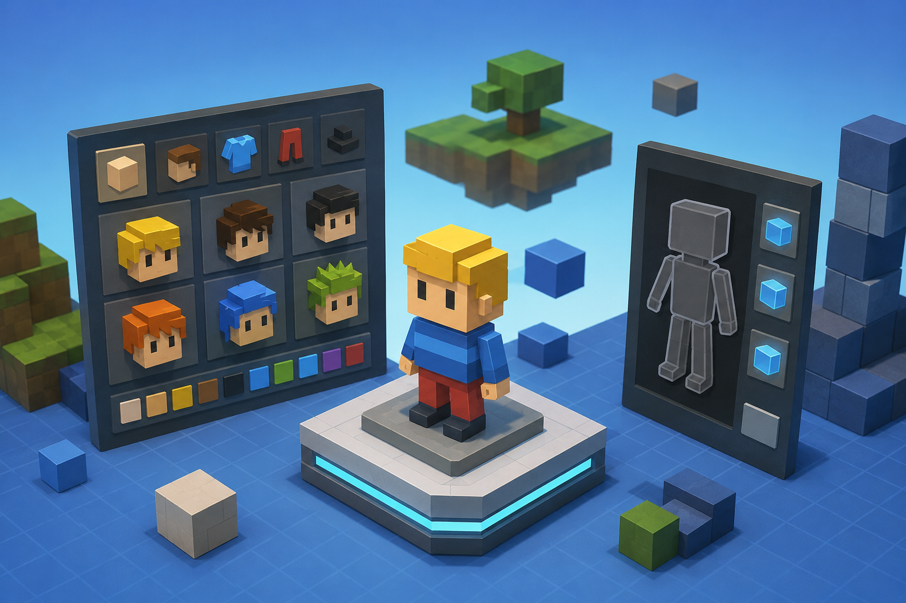

# MauryDev.KoGaMa.AvatarAPI



A library for managing and serializing avatar information for KoGaMa.

## Author
Maury

## Overview
The `MauryDev.KoGaMa.AvatarAPI` library provides the data structures and interfaces necessary to handle avatar compositions, including part mapping, bone positions, and spatial constraints.

## Key Components

### `AvatarInfo`
The central class used to store avatar data. It manages an array of `ModelInfo` parts and provides metadata for:
- **Bone Positions**: Default spatial offsets for avatar parts via `GetBonePosition`.
- **Constraints**: Minimum cube counts and bounding box constraints (`PartConstraintsBoxMin` / `PartConstraintsBoxMax`) for different avatar segments.
- **Indexing**: Quick access to parts using the `PartIndex` enum.

### `ISerializer`
An interface defining the contract for serializing and deserializing `AvatarInfo` objects to and from a `Stream`.

### `PartIndex`
An enumeration used to identify specific avatar parts (e.g., `Head`, `Torso`, `RArm`, `LLowLeg`, etc.), ensuring type-safe access to the `AvatarInfo` parts array.

## Technical Specifications
- **Target Framework**: `.NET Standard 2.0`
- **C# Version**: `7.3`
- **Dependencies**: 
    - `MauryDev.KoGaMa.ModelAPI`
    - `System.Numerics.Vectors`

## Usage Example

```
using MauryDev.KoGaMa.AvatarAPI;
using MauryDev.KoGaMa.AvatarAPI.Enums;

// Accessing bone position for the head
var headPosition = avatarInfo.GetBonePosition(PartIndex.Head);

// Accessing a specific model part
var torsoModel = avatarInfo[PartIndex.Torso];
```